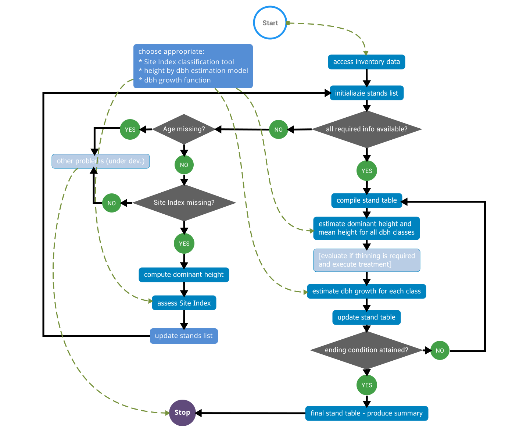

output:
  html_document: default
  html_notebook: default


# Introduction

{ width=80% }

# Workplan: main modules
~~~~~~~
access inventory data  
initialiazie stands list  
  
choose appropriate:  
	* Site Index classification tool  
	* height by dbh estimation model  
	* dbh growth function  
  
CHECK  
	all required info available?  
		YES, proceed to GROW  
	Age missing?  
		YES, goto (A)  
	Site Index missing?  
		NO, goto (A)  
		compute dominant height  
		assess Site Index  
		update stands list  
		(back to (0))  
	(A) other problems (under dev.), STOP  

GROW  
	(1) compile stand table  
	estimate dominant height and mean height for all dbh classes  
	[evaluate if thinning is required and execute treatment]   
	estimate dbh growth for each class  
	update stand table  
	ending condition attained?  
		NO, (back to (1))  
final stand table - produce summary 
~~~~~~~

# Implementation

## access inventory data


```r
library(googlesheets)
library(dplyr)
```

```
## 
## Attaching package: 'dplyr'
```

```
## The following objects are masked from 'package:stats':
## 
##     filter, lag
```

```
## The following objects are masked from 'package:base':
## 
##     intersect, setdiff, setequal, union
```

```r
library(tidyr)
library(magrittr)
```

```
## 
## Attaching package: 'magrittr'
```

```
## The following object is masked from 'package:tidyr':
## 
##     extract
```

```r
getwd()
```

```
## [1] "C:/Users/ro/Documents/RICERCA/GitHub/DouglasFirGrowthModel_Italy/GO_DoNaTo"
```

```r
source("Functions/access2DB.R", echo=F, verbose=F)
```

```
## Sheet successfully identified: "GO_baseDati"
```

```r
tibble::tribble(
  ~table,              ~sheet,
  "species",           "Specie",
  "stands",            "AdS",
  "dbh_tally",         "Cavallettamento",
  "heights",           "Altezze",
  "increment_borings", "Carotine") %>% 
  group_by(sheet) %>% 
  do(assign(.$table, gs_read(DataBase, ws=.$sheet), pos=1)) %>%
  rm()
```

```
## Accessing worksheet titled 'AdS'.
```

```
## Parsed with column specification:
## cols(
##   id_ads = col_character(),
##   AdS_etichetta = col_character(),
##   quota = col_integer(),
##   `pend (%)` = col_integer(),
##   espos = col_character(),
##   eta2017 = col_integer(),
##   etaInizialeCarotina = col_integer(),
##   n.anelloPerEtàInizialeCarotina = col_integer(),
##   note = col_character(),
##   sup_m_quadri = col_integer(),
##   data_rilievo = col_character(),
##   NOTE_SELVICOLTURA = col_character(),
##   rilevatori = col_character()
## )
```

```
## Accessing worksheet titled 'Altezze'.
```

```
## Error in function_list[[k]](value): Too Many Requests (RFC 6585) (HTTP 429).
```

Add a new chunk by clicking the *Insert Chunk* button on the toolbar or by pressing *Ctrl+Alt+I*.

When you save the notebook, an HTML file containing the code and output will be saved alongside it (click the *Preview* button or press *Ctrl+Shift+K* to preview the HTML file).
